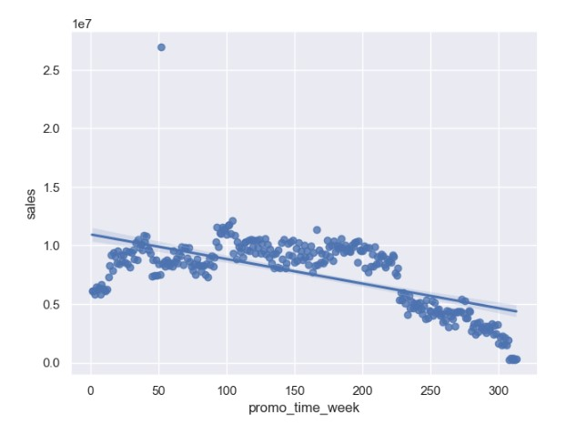

# Projeto de Previsão de Vendas 

Contextualização:
A Rossmann opera mais de 3.000 drogarias em 7 países europeus. Atualmente, os gerentes da loja têm a tarefa de prever suas vendas diárias com até seis semanas de antecedência. As vendas da loja são influenciadas por muitos fatores, incluindo promoções, concorrência, feriados escolares e estaduais, sazonalidade e localidade. O processo de predição das vendas é baseado em experiências passadas, a precisão dos resultados pode variar bastante.

## 1. Problema de negócio
O CFO solicitou aos gerentes das lojas a previsão de vendas (faturamento) para as próximas 6 semanas em uma reunião mensal de resultados. O objetivo é compreender quanto cada loja pode contribuir financeiramente para a reforma das lojas.

 ## 2. Premissas de negócio
- A consulta da previsão de vendas deve estar diponível 24/7, e deve ser acessível via dispositivos móveis.

## 3. Planejamento da solução

### 3.1. Produto final
O que será entregue efetivamente?
- Um bot (robô) no Telegram, que recebe como entrada o código da loja, e retorna instantaneamente qual a sua previsão de vendas (faturamento) para as próximas 6 semanas.

### 3.2. Ferramentas
Quais ferramentas serão usadas no processo?
- Python 3.8.16;
- Jupyter Notebook;
- Git e Github;
- Render; 
- Algoritmos de Regressão;
- Bibliotecas de Machine Learning Sklearn;
- Técnicas de Seleção de Features;
- Flask e Python API's.
- Telegram

## 4. Os 3 principais insights dos dados
Durante a análise exploratória de dados, foram gerados insights ao time de negócio. 

Insights são descobertas através dos dados que são inesperadas ou que contrapõe crenças até então estabelecidas do time de negócios. São também acionáveis: possibilitam ação para direcionar resultados futuros, caso contrário ele é somente uma curiosidade.

A análise detalhada dos dados foi realizada através da ferramenta SweetViz, e pode ser encontrada na pasta "reports" deste projeto.

Os 3 principais insights gerados foram:

#### H4 - Lojas com promoções ativas por mais tempo deveriam vender mais.
Hipótese falsa. Foi observado que as vendas cairam em toda a rede em promoções extendidas ativas há mais de 220 semanas.

* Insight de negócio: Descontinuar as promoções extendidas ativas ao atingirem no máximo 220 semanas, mantendo apenas promoções pontuais, ou realizando novas campanhas promocionais.

#### H9 - Lojas deveriam vender mais no segundo semestre do ano.
Hipótese falsa. Foi observado que com exceção do mês de julho, as vendas são aproximadamente 1/3 menores nos 5 últimos meses do ano. 

* Insight de negócio: Considerar o declínio sazonal histórico de vendas entre os meses de agosto a dezembro, compensando este fenômeno como ações de marketing adicionais.  

#### H12 - Lojas deveriam vender menos durante os feriados escolares.
Hipótese verdadeira. Na média anual, as lojas vendem menos em feriados escolares. Avaliando mensalmente, a exceção é o mês de agosto.

* Insight de negócio: Considerar um maior aproveitamento deste aumento de vendas nos feriados escolares de julho e agosto, elaborando promoções focadas em clientes nas faixas etárias escolares.

## 5. Resultados do modelo de previsão de vendas

O algoritmo escolhido para produção foi o XGBoost Regressor, tendo um erro absoluto médio (MAE) de €775 após o cross-validation.

Desta forma, a cada predição para 6 semanas, o modelo erra em torno de €775 por dia (± 11%).

Uma comparação entre vendas reais e vendas previstas pode ser vista abaixo:

## 6. Resultados financeiros para o negócio
As previsões de vendas da Rossmann, eram até antes deste projeto realizadas por meio de planilhas de histórico de venda, através de uma média móvel.
A taxa de erros desta previsão de vendas de toda a rede ficava na média de 36%, chegando a até 60% nas lojas mais recentes.

Após a implementação deste modelo de previsão de vendas com machine learning, a taxa de erro média das previsões em toda a rede passou para 11%.

Essa redução do erro de 26% em média, propiciou que o CFO fosse muito mais assertivo nos empréstimos bancários que fará para a reforma das lojas da rede.

## 7. Conclusão
O objetivo do projeto foi alcançado, resolvendo o problema inicial de previsibilidade de faturamento enfrentado pelo CFO. 

Além disso, o projeto também viabiliou uma melhoria na gestão financeira da Rossmann, através de uma melhor gestão de fluxo de caixa.

## 8 Referências
* O Dataset foi obtido no [Kaggle](https://www.kaggle.com/c/rossmann-store-sales)
